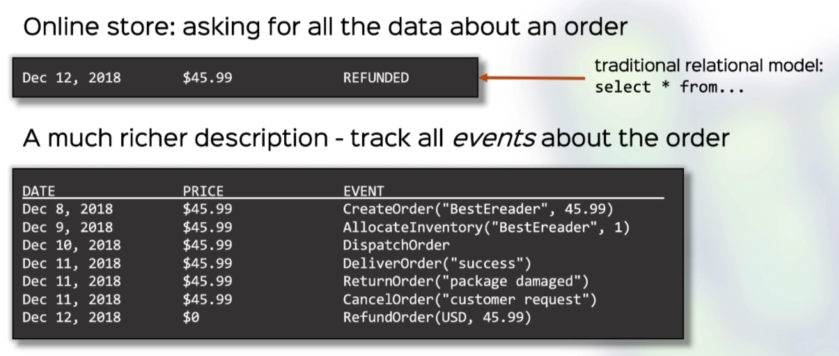
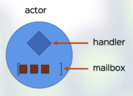
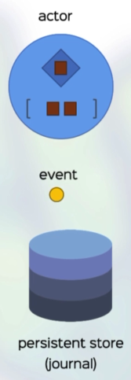
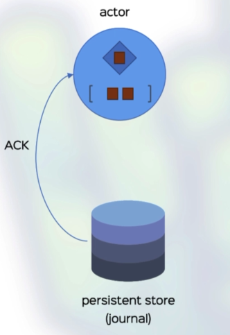
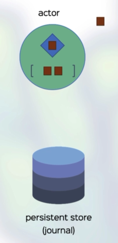
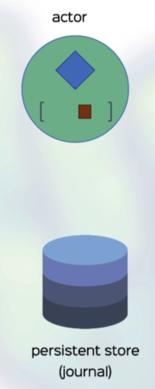
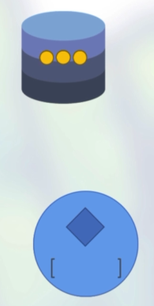
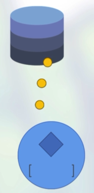
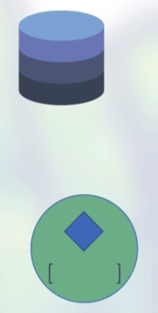

# Event Sourcing

So, instead of storing the **current state**, we'll store **events**. We can always recreate the current state by replaying events.What we now have is **event sourcing**.

**Advantages:**

- High performance when writing; events are only appended
- Avoids relational stores and ORM entirely; no more domain modelling mismatch
- Full trace of every state such as an audit trail
- Fits the Akka actor model as each event will be an Akka message

**Disadvantages**:

- Querying state is potentially expensive as we replay events (Akka Persistence Query can help)
- Potential performance issues with long lived entities (snapshotting can help)
- Data model is subject to change which can be painful (Akka can help with schema evolution)

Event sourcing in Akka is achieved with **persistent actors**.

## Peristent Actors

A persistent actor can do everything a normal actor can do such as:

- Send and receive messages
- Hold internal state
- Run in parallel with many other actors

**Extra capabilities** of a persistent actor:

- Have a **persistent ID**
- **Persist** events to a long term store
- **Recover** state by replaying events from the store

When a actor handles a **message** (what we call a **command** when dealing with a persistent actor):

- It can (asynchronously) persist an event to the store
- After the event is persisted, it changes its internal state

When an actor **starts / restarts**:

- It replays **all** events with its persistence ID

## Example of Persistent Actor Handling a Command

Commands come into the actor's mailbox which the handler can process one as a time:

So, handler takes a command whereby an event is persisted:

The event is **ack**ed:

The actor can change its state and/or send messages to other actors:

Leaving the actor is some state and ready to process the next command (message):

## Example of Persistent Actor Starting Up

When a persistent actor boots, it will first check for a persisted events for its persistence ID:

If there are any events, the actor will receive them and change its state accordingly:

​                                       